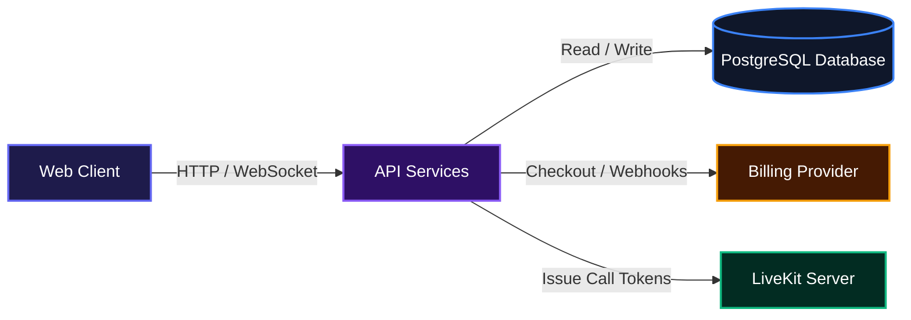
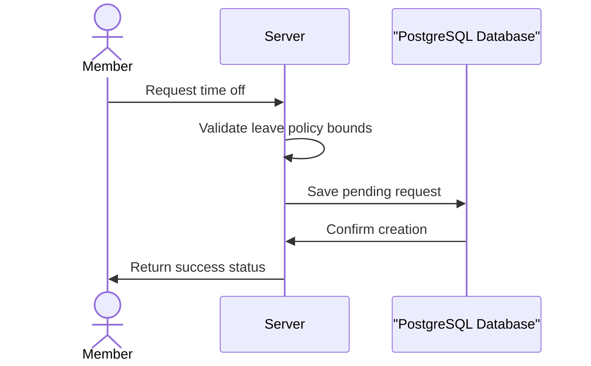
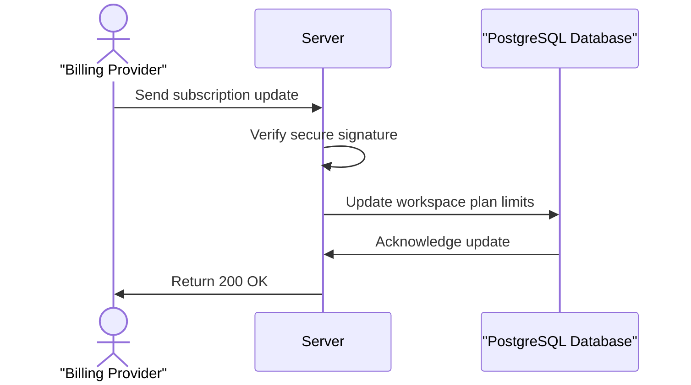

# Teamlyf

Teamlyf is a comprehensive workspace management platform that unites project tracking, human resources, real-time communication, and AI agents into a single environment. 

## Overview

Teamlyf helps teams manage their entire daily workflow in one place. It brings together project management, human resources, internal chat, and document collaboration so organizations can operate without juggling multiple separate tools. Teams can create tasks, request time off, jump into video calls, and leverage AI agents from a unified interface.

## System Architecture



## Installation

Follow these steps to set up the project locally.

Clone the Repository:
```bash
git clone https://github.com/Mbazu-Daniel/Teamlyf.git
cd Teamlyf
```

Install dependencies:
```bash
pnpm install
```

Set up your environment variables:
```bash
cp .env.example .env
```

Start the database using Docker:
```bash
pnpm db:up
```

Run database migrations:
```bash
pnpm db:generate
pnpm db:migrate
```

Start the development server:
```bash
pnpm dev
```

## Usage

Once the development server is running, the API will be available on port 3101 by default. You can navigate to the API documentation route at `/api/v1/docs` in your browser to explore the available endpoints. 

To create your first workspace, you will need to sign up a new user, create an organization, and then begin inviting team members. Use the CLI tool to audit your codebase health periodically.

Run a strict audit on your code changes:
```bash
pnpm fallow:audit
```

## Features

### Human Resources Management
Teamlyf includes a dedicated HR module that tracks employee profiles, leave policies, and time-off balances. Team members can request time off, and managers can review, approve, or reject these requests seamlessly. Balances are calculated dynamically based on policy allowances and approved time off.



### Project and Task Tracking
Teams can organize their work using projects, milestones, tasks, and labels. The system supports detailed task assignments, priority levels, custom statuses, and threaded comments for focused discussions on individual deliverables.

### Real-time Communication
The platform provides instant messaging through channels and direct messages, featuring threaded replies and emoji reactions. It also integrates video and audio calls by issuing secure tokens for a dedicated real-time communication server.

### AI Agent Integration
Organizations can deploy managed or bring-your-own-key AI agents directly into their workspace. The platform tracks agent usage, token consumption, and estimated costs to ensure billing limits are respected.

### Automated Billing and Subscriptions
The system integrates with external billing providers to handle workspace upgrades. It processes secure webhooks to automatically adjust seat limits, agent allowances, and call durations based on the active tier.



## Technologies Used

| Category | Technology |
|---|---|
| Backend Framework | [NestJS](https://nestjs.com/) |
| Runtime | [Node.js](https://nodejs.org/) |
| Language | [TypeScript](https://www.typescriptlang.org/) |
| Database | [PostgreSQL](https://www.postgresql.org/) |
| ORM | [Drizzle](https://orm.drizzle.team/) |
| Authentication | [Better Auth](https://better-auth.com/) |
| Package Manager | [pnpm](https://pnpm.io/) |

## Author Info

* Daniel Mbazu: https://github.com/Mbazu-Daniel
* Joy Ibini: https://github.com/Nastechy